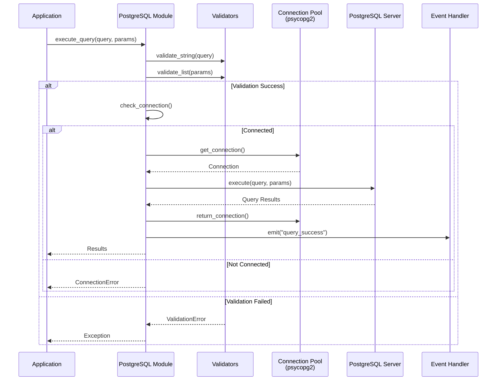
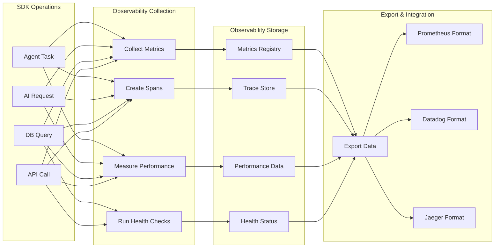

# Metadata Python SDK - Architecture & Workflow Visualization

## Table of Contents
- [System Architecture Overview](#system-architecture-overview)
- [Component Interaction Diagram](#component-interaction-diagram)
- [Data Flow Architecture](#data-flow-architecture)
- [Module Dependencies](#module-dependencies)
- [Workflow Diagrams](#workflow-diagrams)
- [Sequence Diagrams](#sequence-diagrams)
- [Observability Architecture](#observability-architecture)
- [Deployment Architecture](#deployment-architecture)

---

## System Architecture Overview

```
┌─────────────────────────────────────────────────────────────────────────┐
│                        Metadata Python SDK                               │
│                         (Unified Interface)                              │
└─────────────────────────────────────────────────────────────────────────┘
                                    │
                    ┌───────────────┼───────────────┐
                    │               │               │
            ┌───────▼──────┐ ┌──────▼──────┐ ┌──────▼──────┐
            │   Core       │ │   Agents    │ │  AI Gateway │
            │  Foundation  │ │   Module    │ │   Module    │
            └───────┬──────┘ └──────┬──────┘ └──────┬──────┘
                    │               │               │
            ┌───────▼──────┐ ┌──────▼──────┐ ┌──────▼──────┐
            │   Database   │ │     API      │ │   Codecs    │
            │   Module     │ │   Module     │ │   Module    │
            └───────┬──────┘ └──────┬──────┘ └──────┬──────┘
                    │               │               │
                    └───────────────┼───────────────┘
                                    │
                            ┌───────▼───────┐
                            │    Config     │
                            │    Module     │
                            │  (Settings,   │
                            │   Logging,    │
                            │ Observability)│
                            └───────────────┘
                                    │
                            ┌───────▼───────┐
                            │ Observability │
                            │  (Metrics,    │
                            │   Tracing,    │
                            │  Monitoring)  │
                            └───────────────┘
```

---

## Component Interaction Diagram


---

## Data Flow Architecture


---

## Module Dependencies


---

## Workflow Diagrams

### 1. Agent Task Execution Workflow (Agno)


### 2. AI Gateway Request Workflow (LiteLLM)


### 3. PostgreSQL Database Operation Workflow



### 4. API Communication Workflow


---

## Detailed Component Communication

### Core Module Internal Structure

```
┌─────────────────────────────────────────────────────────────┐
│                      Core Module                            │
├─────────────────────────────────────────────────────────────┤
│                                                             │
│  ┌──────────────┐  ┌──────────────┐  ┌──────────────┐    │
│  │   Data       │  │  Concurrency │  │    Event     │    │
│  │ Structures  │  │   Utilities  │  │   Handler     │    │
│  └──────┬───────┘  └──────┬───────┘  └──────┬───────┘    │
│         │                 │                 │             │
│         └─────────────────┼─────────────────┘             │
│                           │                               │
│  ┌──────────────┐  ┌──────▼───────┐  ┌──────────────┐   │
│  │  Validators  │  │   Utilities  │  │  Exceptions  │   │
│  └──────┬───────┘  └──────────────┘  └──────┬───────┘   │
│         │                                    │            │
│         └────────────────────────────────────┘            │
│                                                           │
│              All modules depend on Core                   │
└───────────────────────────────────────────────────────────┘
```

### Agent Module Architecture (Agno Framework)

```
┌─────────────────────────────────────────────────────────────┐
│                    Agent Module (Agno)                      │
├─────────────────────────────────────────────────────────────┤
│                                                             │
│  ┌─────────────────────────────────────────────────────┐  │
│  │              Agent Class                            │  │
│  │  - Lifecycle Management (start, stop)              │  │
│  │  - Task Execution via Agno                        │  │
│  │  - Event Handling                                    │  │
│  │  - Status Management                                 │  │
│  └──────────────┬──────────────────────────────────────┘  │
│                 │                                          │
│  ┌──────────────▼──────────────────────────────────────┐  │
│  │        Agno Framework Integration                   │  │
│  │  - AgnoAgent (from agno package)                   │  │
│  │  - LLM Integration                                  │  │
│  │  - Intelligent Task Processing                     │  │
│  └──────────────┬──────────────────────────────────────┘  │
│                 │                                          │
│  ┌──────────────▼──────────────────────────────────────┐  │
│  │        Agent Communicator                           │  │
│  │  - Message Sending/Receiving                         │  │
│  │  - Topic Subscription                               │  │
│  │  - Protocol Handling (NATS, etc.)                   │  │
│  └──────────────┬──────────────────────────────────────┘  │
│                 │                                          │
│                 ├──────────────┐                          │
│                 │              │                          │
│  ┌──────────────▼──┐  ┌────────▼──────────┐              │
│  │  Event Emitter  │  │  LiteLLM Gateway  │              │
│  │  (from Core)    │  │  (for AI tasks)   │              │
│  └─────────────────┘  └──────────────────┘              │
│                                                           │
└───────────────────────────────────────────────────────────┘
```

### AI Gateway Module Architecture

```
┌─────────────────────────────────────────────────────────────┐
│                  AI Gateway Module                          │
├─────────────────────────────────────────────────────────────┤
│                                                             │
│  ┌─────────────────────────────────────────────────────┐  │
│  │              AIGateway (Main Interface)              │  │
│  │  - generate()                                       │  │
│  │  - chat()                                           │  │
│  │  - embed()                                          │  │
│  └──────────────┬──────────────────────────────────────┘  │
│                 │                                          │
│  ┌──────────────▼──────────────────────────────────────┐  │
│  │        Model Integration Factory                    │  │
│  │  - LiteLLMProvider                                  │  │
│  │  (Unified interface for OpenAI, Anthropic,          │  │
│  │   Gemini, and other providers)                     │  │
│  └──────────────┬──────────────────────────────────────┘  │
│                 │                                          │
│  ┌──────────────▼──────────────────────────────────────┐  │
│  │        Prompt Manager                               │  │
│  │  - Template Management                              │  │
│  │  - Dynamic Prompt Generation                        │  │
│  └──────────────┬──────────────────────────────────────┘  │
│                 │                                          │
│  ┌──────────────▼──────────────────────────────────────┐  │
│  │        Input/Output Processing                      │  │
│  │  - preprocess_input()                               │  │
│  │  - postprocess_output()                             │  │
│  │  - normalize_text()                                 │  │
│  │  - chunk_text()                                     │  │
│  └─────────────────────────────────────────────────────┘  │
│                                                           │
└───────────────────────────────────────────────────────────┘
```

---

## Complete System Workflow


---

## Error Handling Flow


---

## Authentication Flow


---

## Configuration Management Flow

```
┌─────────────────────────────────────────────────────────────┐
│              Configuration Management                       │
├─────────────────────────────────────────────────────────────┤
│                                                             │
│  ┌──────────────┐  ┌──────────────┐  ┌──────────────┐    │
│  │  File Config │  │  Env Config  │  │  Code Config │    │
│  │  (JSON/YAML) │  │  Variables   │  │  (Dict)      │    │
│  └──────┬───────┘  └──────┬───────┘  └──────┬───────┘    │
│         │                 │                 │             │
│         └─────────────────┼─────────────────┘             │
│                           │                               │
│                  ┌────────▼────────┐                      │
│                  │  Settings Class │                      │
│                  │  - Merge Config │                      │
│                  │  - Validate     │                      │
│                  │  - Cache        │                      │
│                  └────────┬────────┘                      │
│                           │                               │
│         ┌─────────────────┼─────────────────┐            │
│         │                 │                 │            │
│  ┌──────▼──────┐  ┌──────▼──────┐  ┌──────▼──────┐     │
│  │   Agents    │  │  AI Gateway │  │  Database   │     │
│  │   Module    │  │   Module    │  │   Module    │     │
│  └─────────────┘  └─────────────┘  └─────────────┘     │
│                                                           │
└───────────────────────────────────────────────────────────┘
```

---

## Data Transformation Pipeline


---

## Module Interaction Matrix

| Module | Depends On | Used By |
|--------|-----------|---------|
| **Core** | None (Foundation) | All Modules |
| **Config** | Core | All Modules |
| **Codecs** | Core | API, AI Gateway |
| **API** | Core, Config, Codecs | Agents, AI Gateway |
| **Database** | Core, Config | Agents, Applications |
| **AI Gateway** | Core, API, Codecs, Config | Agents, Applications |
| **Agents** | Core, API, Config | Applications |
| **Observability** | Core, Config, Event Handler | All Modules, Monitoring Tools |

---

## Key Design Principles

### 1. **Layered Architecture**
- **Layer 1**: Core foundation (data structures, utilities, exceptions)
- **Layer 2**: Base modules (config, codecs, observability)
- **Layer 3**: Functional modules (agents, AI, database, API)
- **Layer 4**: Application code

### 2. **Dependency Flow**
- All modules depend on Core
- No circular dependencies
- Clear separation of concerns

### 3. **Error Handling**
- Centralized exception hierarchy
- Validation at entry points
- Detailed error context

### 4. **Event-Driven**
- Event emission for important operations
- Asynchronous event handling
- Decoupled component communication

### 5. **Type Safety**
- Full type hints throughout
- Input validation on all public methods
- Runtime type checking

### 6. **Observability**
- Comprehensive metrics collection (counters, gauges, histograms)
- Distributed tracing across services
- Performance monitoring (latency, throughput)
- Health checks for system components
- Integration with monitoring tools (Prometheus, Datadog, Jaeger)

---

## Observability Architecture

### Observability Component Structure


### Observability Data Flow



### Observability Integration Workflow


### Metrics Collection Flow


### Health Check Architecture


### Observability Integration Points

```
┌─────────────────────────────────────────────────────────────┐
│              SDK Module (Agent/AI/DB/API)                    │
└───────────────────────┬─────────────────────────────────────┘
                        │
                        │ Observability Hooks
                        │
        ┌───────────────┼───────────────┐
        │               │               │
┌───────▼──────┐ ┌──────▼──────┐ ┌──────▼──────┐
│   Metrics    │ │   Tracing   │ │ Performance │
│  Collection  │ │   System    │ │  Monitoring │
└───────┬──────┘ └──────┬──────┘ └──────┬──────┘
        │               │               │
        └───────────────┼───────────────┘
                        │
                ┌───────▼───────┐
                │ Observability │
                │   Main Class  │
                └───────┬───────┘
                        │
        ┌───────────────┼───────────────┐
        │               │               │
┌───────▼──────┐ ┌──────▼──────┐ ┌──────▼──────┐
│  Prometheus  │ │   Datadog   │ │   Jaeger    │
│   Exporter   │ │   Adapter   │ │   Adapter   │
└──────────────┘ └─────────────┘ └─────────────┘
```

---

## Deployment Architecture

```
┌─────────────────────────────────────────────────────────────┐
│                    Application Layer                         │
│              (User's Application Code)                       │
└───────────────────────┬─────────────────────────────────────┘
                        │
┌───────────────────────▼─────────────────────────────────────┐
│                  Metadata Python SDK                         │
│  ┌──────────┐  ┌──────────┐  ┌──────────┐  ┌──────────┐   │
│  │ Agents   │  │    AI    │  │ Database │  │   API    │   │
│  │ Module   │  │ Gateway  │  │  Module  │  │  Module  │   │
│  └────┬─────┘  └────┬─────┘  └────┬─────┘  └────┬─────┘   │
│       │             │              │             │          │
│       └─────────────┼──────────────┼─────────────┘          │
│                     │              │                        │
│              ┌──────▼──────────────▼──────┐                │
│              │      Core Module           │                │
│              │  (Foundation & Utilities) │                │
│              └──────────────┬─────────────┘                │
│                             │                              │
│              ┌──────────────▼──────────────┐              │
│              │   Config & Observability    │              │
│              │  (Settings, Logging,        │              │
│              │   Metrics, Tracing)        │              │
│              └─────────────────────────────┘              │
└───────────────────────┬─────────────────────────────────────┘
                        │
        ┌───────────────┼───────────────┐
        │               │               │
┌───────▼──────┐ ┌──────▼──────┐ ┌──────▼──────┐
│   LiteLLM    │ │ PostgreSQL  │ │ External    │
│ (AI Gateway) │ │  Database   │ │ APIs        │
│ OpenAI,      │ │             │ │             │
│ Anthropic,   │ │             │ │             │
│ Gemini, etc. │ │             │ │             │
└──────────────┘ └─────────────┘ └─────────────┘
                        │
        ┌───────────────┼───────────────┐
        │               │               │
┌───────▼──────┐ ┌──────▼──────┐ ┌──────▼──────┐
│ Prometheus   │ │   Datadog   │ │   Jaeger    │
│ (Metrics)    │ │   (APM)     │ │  (Tracing)  │
└──────────────┘ └─────────────┘ └─────────────┘
```

---

## Summary

This architecture visualization demonstrates:

1. **Clear Separation of Concerns**: Each module has a specific responsibility
2. **Dependency Management**: Core module provides foundation for all others
3. **Data Flow**: Clear paths from input to output with validation and transformation
4. **Error Handling**: Comprehensive exception handling at every layer
5. **Scalability**: Modular design allows easy extension and modification
6. **Type Safety**: Validation ensures data integrity throughout the system
7. **Event-Driven**: Asynchronous event handling for decoupled communication
8. **Observability**: Comprehensive monitoring with metrics, tracing, performance tracking, and health checks

The SDK is designed to be:
- **Modular**: Use only what you need
- **Extensible**: Easy to add new providers, databases, or features
- **Reliable**: Comprehensive error handling and validation
- **Performant**: Async support and efficient data processing
- **Maintainable**: Clear architecture and documentation
- **Observable**: Full visibility into system behavior with metrics, traces, and health monitoring

